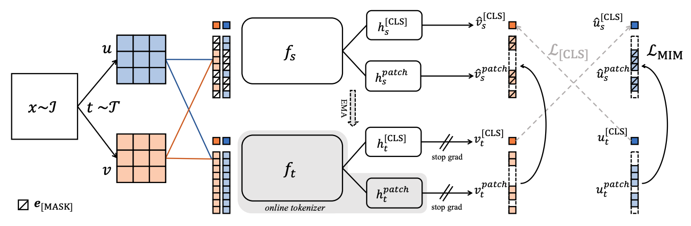

<div align="center">
<h1>Image BERT Mamba </h1>
<h3>Image BERT Pre-Training with Vision Mamba</h3>
</div>



## Envs. for Pretraining

- Python 3.10.13

  - `conda create -n your_env_name python=3.10.13`

- torch 2.1.1 + cu118
  - `pip install torch==2.1.1 torchvision==0.16.1 torchaudio==2.1.1 --index-url https://download.pytorch.org/whl/cu118`

- Requirements: vim_requirements.txt
  - `pip install -r vim_requirements.txt`

- Install ``causal_conv1d`` and ``mamba``
  - `pip install causal_conv1d==1.1.1`
  - `pip install mamba-ssm==1.2.0.post1`
  - `cp -rf mamba_ssm /opt/conda/lib/python3.10/site-packages`

## Training

```
MASTER_PORT=29500 bash run.sh imagenet_pretrain $JOB_NAME {vim_tiny, vim_small, vim_base} teacher 8 \
  --data_path /data/imagenet/train \
  --teacher_temp 0.07 \
  --warmup_teacher_temp_epochs 30 \
  --norm_last_layer false \
  --epochs 300 \
  --batch_size_per_gpu 128 \
  --shared_head true \
  --out_dim 8192 \
  --local_crops_number 10 \
  --global_crops_scale 0.25 1 \
  --local_crops_scale 0.05 0.25 \
  --pred_ratio 0 0.3 \
  --pred_ratio_var 0 0.2
```

## Acknowledgement :heart:
This project is based on Mamba ([paper](https://arxiv.org/abs/2312.00752), [code](https://github.com/state-spaces/mamba)), Causal-Conv1d ([code](https://github.com/Dao-AILab/causal-conv1d)), DeiT ([paper](https://arxiv.org/abs/2012.12877), [code](https://github.com/facebookresearch/deit)), Vision Mamba ([paper](https://arxiv.org/abs/2401.09417), [code](https://github.com/hustvl/Vim/tree/main)), iBOT ([paper](https://arxiv.org/abs/2111.07832), [code](https://github.com/bytedance/ibot)). Thanks for their wonderful works.
